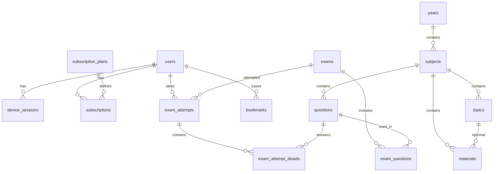

# MedStudy — Database Schema

PostgreSQL 16 · Prisma ORM

---

## Entity Relationship



---

## Enums

```sql
-- User roles
CREATE TYPE user_role AS ENUM ('STUDENT', 'ADMIN', 'SUPER_ADMIN');

-- Subscription status
CREATE TYPE subscription_status AS ENUM ('ACTIVE', 'EXPIRED', 'CANCELLED', 'PENDING');

-- Plan types
CREATE TYPE plan_type AS ENUM (
  'YEAR_1', 'YEAR_2', 'YEAR_3', 'YEAR_4', 'YEAR_5',
  'FCPS_PART_1', 'FCPS_PART_2',
  'ALL_MBBS', 'ULTIMATE_BUNDLE'
);

-- Material types
CREATE TYPE material_type AS ENUM ('PDF', 'VIDEO', 'NOTES');

-- Question difficulty
CREATE TYPE difficulty AS ENUM ('EASY', 'MEDIUM', 'HARD');

-- Exam attempt status
CREATE TYPE attempt_status AS ENUM ('IN_PROGRESS', 'COMPLETED', 'ABANDONED');
```

---

## Tables

### users

| Column | Type | Notes |
|--------|------|-------|
| id | UUID | PK |
| email | VARCHAR(255) | UNIQUE, NOT NULL |
| password_hash | VARCHAR(255) | bcrypt |
| full_name | VARCHAR(255) | |
| role | user_role | DEFAULT 'STUDENT' |
| is_banned | BOOLEAN | DEFAULT false |
| created_at | TIMESTAMPTZ | |
| updated_at | TIMESTAMPTZ | |

### device_sessions

| Column | Type | Notes |
|--------|------|-------|
| id | UUID | PK |
| user_id | UUID | FK → users |
| device_id | VARCHAR(255) | Client-generated fingerprint |
| device_name | VARCHAR(255) | e.g. "Samsung Galaxy A54" |
| refresh_token_hash | VARCHAR(255) | Hashed refresh token |
| is_active | BOOLEAN | Only one active per user |
| last_active_at | TIMESTAMPTZ | |
| created_at | TIMESTAMPTZ | |

**Index:** `(user_id, is_active)` — enforce single active session

### subscription_plans

| Column | Type | Notes |
|--------|------|-------|
| id | UUID | PK |
| name | VARCHAR(255) | e.g. "Year 3" |
| plan_type | plan_type | UNIQUE |
| price_pkr | INTEGER | Price in PKR |
| duration_days | INTEGER | Usually 365 |
| revenuecat_product_id | VARCHAR(255) | Maps to store product |
| is_active | BOOLEAN | |

### subscriptions

| Column | Type | Notes |
|--------|------|-------|
| id | UUID | PK |
| user_id | UUID | FK → users |
| plan_id | UUID | FK → subscription_plans |
| status | subscription_status | |
| start_date | TIMESTAMPTZ | |
| end_date | TIMESTAMPTZ | |
| revenuecat_subscriber_id | VARCHAR(255) | |
| created_at | TIMESTAMPTZ | |

### years

| Column | Type | Notes |
|--------|------|-------|
| id | UUID | PK |
| name | VARCHAR(100) | "Year 1", "FCPS Part 1" |
| slug | VARCHAR(50) | "year-1", "fcps-part-1" |
| sort_order | INTEGER | |
| plan_type | plan_type | Which subscription grants access |

### subjects

| Column | Type | Notes |
|--------|------|-------|
| id | UUID | PK |
| year_id | UUID | FK → years |
| name | VARCHAR(255) | "Anatomy" |
| slug | VARCHAR(100) | |
| sort_order | INTEGER | |

### topics

| Column | Type | Notes |
|--------|------|-------|
| id | UUID | PK |
| subject_id | UUID | FK → subjects |
| name | VARCHAR(255) | |
| sort_order | INTEGER | |

### materials

| Column | Type | Notes |
|--------|------|-------|
| id | UUID | PK |
| subject_id | UUID | FK → subjects |
| topic_id | UUID | FK → topics, nullable |
| title | VARCHAR(500) | |
| type | material_type | |
| file_key | VARCHAR(500) | R2 object key |
| file_size_bytes | BIGINT | |
| is_downloadable | BOOLEAN | DEFAULT true |
| is_published | BOOLEAN | DEFAULT false |
| is_past_paper | BOOLEAN | DEFAULT false |
| past_paper_year | INTEGER | nullable |
| past_paper_session | VARCHAR(50) | e.g. "Annual 2024" |
| created_at | TIMESTAMPTZ | |

### questions

| Column | Type | Notes |
|--------|------|-------|
| id | UUID | PK |
| subject_id | UUID | FK → subjects |
| stem | TEXT | Question text |
| options | JSONB | `[{"id":"a","text":"..."}, ...]` |
| correct_option_id | VARCHAR(10) | e.g. "a" |
| explanation | TEXT | Why correct + why others wrong |
| difficulty | difficulty | |
| tags | JSONB | `["cardiology","fcps"]` |
| is_published | BOOLEAN | |
| created_at | TIMESTAMPTZ | |

### exams

| Column | Type | Notes |
|--------|------|-------|
| id | UUID | PK |
| title | VARCHAR(500) | |
| subject_id | UUID | FK → subjects |
| duration_minutes | INTEGER | |
| question_count | INTEGER | |
| shuffle_questions | BOOLEAN | DEFAULT true |
| shuffle_options | BOOLEAN | DEFAULT false |
| is_published | BOOLEAN | |
| created_at | TIMESTAMPTZ | |

### exam_questions

| Column | Type | Notes |
|--------|------|-------|
| exam_id | UUID | FK → exams |
| question_id | UUID | FK → questions |
| sort_order | INTEGER | |
| PRIMARY KEY | (exam_id, question_id) | |

### exam_attempts

| Column | Type | Notes |
|--------|------|-------|
| id | UUID | PK |
| user_id | UUID | FK → users |
| exam_id | UUID | FK → exams |
| status | attempt_status | |
| score | INTEGER | Correct count |
| total | INTEGER | Total questions |
| percentage | DECIMAL(5,2) | |
| started_at | TIMESTAMPTZ | |
| completed_at | TIMESTAMPTZ | nullable |

### exam_attempt_details

| Column | Type | Notes |
|--------|------|-------|
| id | UUID | PK |
| attempt_id | UUID | FK → exam_attempts |
| question_id | UUID | FK → questions |
| selected_option_id | VARCHAR(10) | nullable if skipped |
| is_correct | BOOLEAN | |
| time_spent_seconds | INTEGER | |

### bookmarks

| Column | Type | Notes |
|--------|------|-------|
| user_id | UUID | FK → users |
| material_id | UUID | FK → materials |
| created_at | TIMESTAMPTZ | |
| PRIMARY KEY | (user_id, material_id) | |

### screenshot_events (iOS logging)

| Column | Type | Notes |
|--------|------|-------|
| id | UUID | PK |
| user_id | UUID | FK → users |
| screen | VARCHAR(100) | e.g. "pdf_viewer" |
| created_at | TIMESTAMPTZ | |

---

## Subscription Access Logic

A user can access content for a `year` if they have an active subscription whose plan includes that year:

| plan_type | Grants access to years |
|-----------|--------------------------|
| YEAR_1 | year-1 |
| YEAR_2 | year-2 |
| ... | ... |
| FCPS_PART_1 | fcps-part-1 |
| ALL_MBBS | year-1 through year-5 |
| ULTIMATE_BUNDLE | all years + FCPS |

Implement in `SubscriptionService.hasAccess(userId, yearSlug)`.
