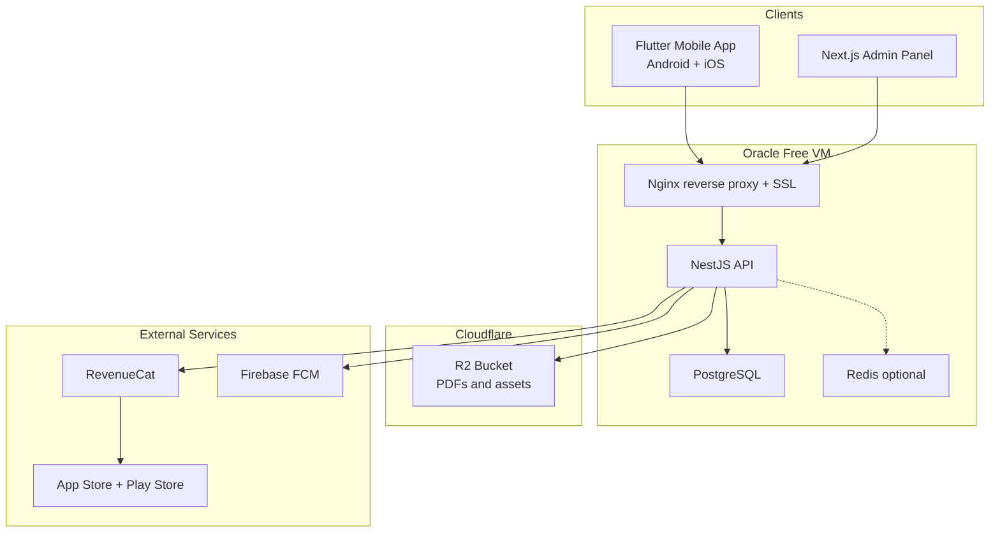

# MedStudy — Final Locked Roadmap

**Status:** LOCKED  
**Last updated:** March 2026  
**Audience:** Development team handoff

---

## 1. Executive Summary

MedStudy is a subscription-based medical education platform for MBBS students (Year 1–5) and FCPS candidates (Part 1 & 2). Students use a **Flutter mobile app** to study PDF materials, take timed MCQ exams, and receive instant grading with explanations. Admins manage content via a **Next.js panel**. All infrastructure starts on **Oracle Cloud free tier** with **Cloudflare R2** for PDF storage.

### Business Model

- Per-year subscriptions (e.g., Year 3 only)
- FCPS Part 1 / Part 2 bundles
- Combo plans (All MBBS, Ultimate Bundle)

### Core Requirements (Non-Negotiable)

1. Single-device login (one active session per user)
2. In-app-only downloads (encrypted, never to gallery/Downloads)
3. Subscription-gated content access
4. MCQ exams with auto-grading + per-question explanations
5. Maximum content protection (platform-dependent — see Section 4)

---

## 2. Locked Technology Stack

| Layer | Technology | Why |
|-------|------------|-----|
| **Mobile** | Flutter (Dart) | Near-native performance; unified PDF viewer + watermarks; Android screenshot block; one codebase for iOS + Android |
| **Admin** | Next.js 15 + TypeScript | Fast dashboards, file uploads, question editor; same language family as backend |
| **API** | NestJS + TypeScript | Modular architecture; JWT auth; guards for roles/subscriptions |
| **ORM** | Prisma | Type-safe PostgreSQL migrations |
| **Database** | PostgreSQL 16 | Relational data; JSONB for question options/tags |
| **Cache** | Redis (Phase 1b or Phase 6) | Device sessions, rate limiting; optional at MVP (use PostgreSQL first) |
| **File storage** | Cloudflare R2 | PDFs/past papers; free egress; cheap scale |
| **Hosting** | Oracle Cloud Always Free VM | API + DB + Redis on one VM ($0) |
| **Payments** | RevenueCat + JazzCash/Easypaisa (optional web) | Mobile in-app subs; local gateways for Pakistan |
| **Push** | Firebase FCM | Exam reminders, subscription expiry |
| **CI/CD** | GitHub Actions | Lint, test, deploy API; Codemagic for Flutter builds |

### What We Are NOT Using

| Rejected | Reason |
|----------|--------|
| PWA-only for students | Weak iOS security and offline UX |
| React Native | Flutter wins for PDF-heavy, watermark-heavy UX |
| Oracle Object Storage (primary) | R2 has free egress; better for many PDF downloads |
| Separate native Swift + Kotlin | Too slow for small team; Flutter is sufficient |

---

## 3. Architecture



### Request Flow — Student Opens PDF

1. Flutter app sends JWT + `deviceId` to `GET /materials/:id/access`
2. API verifies: valid token, active device session, active subscription for that year
3. API generates R2 **presigned URL** (15-minute expiry)
4. App streams PDF in secure viewer with **user watermark overlay**
5. Optional: user taps Download → API returns encrypted blob → stored in app sandbox

### Request Flow — Single Device Login

1. User logs in on Device B with email + password + `deviceId`
2. API revokes Device A session in DB/Redis
3. Device A receives 401 on next request → forced logout
4. Admin can reset device binding via admin panel

---

## 4. Security Matrix — Android vs iOS

**Critical:** No platform can achieve 100% screenshot protection on iPhone. Plan and market accordingly.

| Feature | Android | iOS | Implementation |
|---------|---------|-----|----------------|
| **Block screenshots** | YES | NO | Android: `FLAG_SECURE` via `flutter_windowmanager`. iOS: detect only + warn |
| **Block screen recording** | YES | NO | Same as above on Android |
| **In-app-only downloads** | YES | YES | Encrypted files in app sandbox; `flutter_secure_storage` for keys |
| **Encrypted offline storage** | YES | YES | AES-encrypted blobs; key revoked on subscription expiry |
| **Dynamic watermark** | YES | YES | User email + ID + timestamp on every PDF page |
| **Single-device login** | YES | YES | Server-side session; JWT bound to `deviceId` |
| **Subscription gating** | YES | YES | Middleware checks active plan before content/exams |
| **Blur on app background** | YES | YES | Hide/blur sensitive screens when app inactive |
| **Root/jailbreak detection** | YES | YES | Warn or block premium content |
| **Signed URLs for files** | YES | YES | R2 presigned URLs; 15-min expiry |
| **Certificate pinning** | YES | YES | Phase 6 hardening |
| **Revoke access on expiry** | YES | YES | Server stops issuing keys/URLs; local cache invalidated |

### User-Facing Security Messaging

**Do say:**  
"Protected study platform with personal watermarks, encrypted in-app storage, single-device access, and screen capture protection on Android."

**Do not say:**  
"Screenshots are impossible on all devices."

---

## 5. Database Overview

Full schema: [DATABASE.md](./DATABASE.md)

### Core Entities

- `users` — students and admins
- `device_sessions` — single-device enforcement
- `subscription_plans` — plan definitions (year1–year5, fcps1, fcps2, bundles)
- `subscriptions` — user entitlements
- `years` — Year 1–5, FCPS Part 1, FCPS Part 2
- `subjects` — Anatomy, Physiology, etc.
- `topics` — optional sub-folder under subject
- `materials` — PDFs, notes; `file_key` points to R2
- `questions` — MCQ bank with options (JSONB), explanation
- `exams` — timed exam definitions
- `exam_attempts` — student submissions and scores
- `bookmarks` — saved materials per user

---

## 6. Development Phases

**Team:** 2–5 people  
**Total timeline:** 7–10 months (full v1) | 4–5 months (MVP)

---

### Phase 0 — Planning & Setup (2–3 weeks)

**Goal:** Repo, designs, schema, API spec ready for development.

| Task | Owner | Deliverable |
|------|-------|-------------|
| Monorepo scaffold (`mobile/`, `backend/`, `admin/`) | Backend lead | Git repo |
| Figma wireframes (mobile + admin) | Designer | Design files |
| PostgreSQL schema + Prisma migrations | Backend | `backend/prisma/schema.prisma` |
| OpenAPI spec | Backend | `docs/API.md` |
| Oracle VM + Cloudflare R2 setup | DevOps/Backend | `.env.example` |
| Define subscription plans + PKR pricing | Product | `docs/PRICING.md` |
| Terms of Service, copyright policy | Product/Legal | `docs/LEGAL.md` |

**Exit criteria:** All devs can run backend locally; schema migrated; R2 bucket created.

---

### Phase 1 — Foundation & Auth (5–6 weeks)

**Goal:** End-to-end auth with single-device enforcement.

**Backend**
- NestJS modules: `auth`, `users`, `devices`
- Register, login, refresh token, logout
- JWT access (15 min) + refresh (7 days) bound to `deviceId`
- Device session table; revoke previous on new login
- Role guards: `STUDENT`, `ADMIN`, `SUPER_ADMIN`
- Admin endpoints: list users, ban user, reset device

**Admin**
- Login page, dashboard shell, sidebar nav
- User list with device info + reset device button

**Mobile**
- Flutter project setup, theme, routing (go_router)
- Login/register screens
- Device ID generation (`device_info_plus` + UUID)
- Secure token storage (`flutter_secure_storage`)
- Auto-logout on 401

**Exit criteria:** Login on Device B kicks Device A; admin can reset device.

---

### Phase 2 — Subscriptions & Payments (3–4 weeks)

**Goal:** Users purchase plans; content access is gated.

- RevenueCat SDK in Flutter (iOS + Android)
- Subscription plans in RevenueCat + mirrored in DB
- Webhook handler: `INITIAL_PURCHASE`, `RENEWAL`, `EXPIRATION`, `CANCELLATION`
- `SubscriptionGuard` on content and exam routes
- Paywall screen in app
- Admin: view user subscription status

**Optional:** JazzCash/Easypaisa web checkout for manual activation (admin assigns plan).

**Exit criteria:** Purchase Year 3 → only Year 3 content accessible; expiry blocks access.

---

### Phase 3 — Content Management & Study (5–6 weeks)

**Goal:** Admin uploads PDFs; students browse, view, download in-app.

**Admin**
- Year → Subject → Topic hierarchy CRUD
- PDF upload to R2 (multipart, progress bar)
- Past papers tagging (year, session)
- Bulk upload (ZIP or multi-select)
- Material publish/unpublish

**Backend**
- `materials` module with R2 upload (AWS SDK S3-compatible)
- Presigned URL generation
- Subscription check before access
- Search and filter API

**Mobile**
- Browse by year/subject
- Secure PDF viewer (`pdfx` or Syncfusion) with watermark overlay
- Android: `FLAG_SECURE` on viewer screens
- iOS: screenshot detection + blur on background
- Encrypted in-app download + offline list
- Bookmarks

**Exit criteria:** Admin uploads PDF; subscribed student views with watermark; offline download works in-app only.

---

### Phase 4 — Exam Engine (6–8 weeks)

**Goal:** Full MCQ exam lifecycle with instant grading and explanations.

**Admin**
- Question bank CRUD (stem, 4–5 options, correct answer, explanation, difficulty, tags)
- Bulk import CSV/Excel
- Rich text editor for explanations (TipTap or similar)
- Exam builder: manual pick or auto-generate from bank
- Publish/unpublish exams
- Analytics: attempts, avg score, most-missed questions

**Backend**
- `questions`, `exams`, `exam_attempts` modules
- Start exam: return questions **without** correct answers
- Submit: grade server-side; return score + per-question breakdown
- Prevent re-submit; optional question shuffle

**Mobile**
- Exam list (filter by year/subject/FCPS)
- Timed exam UI: countdown, question palette, mark for review
- Submit → results screen (score, %, time)
- Review mode: each question with selected vs correct + explanation
- Exam history and weak topics

**Exit criteria:** Admin creates exam; student completes; instant results with explanations.

---

### Phase 5 — FCPS & Content Population (4–6 weeks)

**Goal:** FCPS modules live; initial content loaded.

- FCPS Part 1 & Part 2 year entries and subjects
- FCPS-specific question tags and filters
- FCPS past papers section
- Content team uploads materials (operational, not code)
- Pagination, lazy loading, PDF compression guidelines
- Performance tuning for large libraries

**Exit criteria:** FCPS sections browsable with initial content batch; app remains smooth with 500+ materials metadata.

---

### Phase 6 — Security Hardening & QA (3–4 weeks)

**Goal:** Production-ready security and stability.

- Certificate pinning (Flutter)
- Jailbreak/root detection (`flutter_jailbreak_detection`)
- iOS screenshot event logging + user warning
- Rate limiting on auth endpoints
- OWASP top 10 review
- Load test: 500 concurrent exam submissions
- Beta with 20–50 students; fix critical bugs
- Sentry error monitoring
- Database backup script on Oracle VM

**Exit criteria:** Beta sign-off; no critical security gaps; backup/restore tested.

---

### Phase 7 — Launch (2–3 weeks)

**Goal:** Live on App Store and Play Store.

- Apple Developer ($99/yr) + Google Play ($25 one-time) accounts
- App Store / Play Store listings (screenshots, descriptions)
- Production deploy: Oracle VM + Nginx + Let's Encrypt SSL
- Domain DNS → Oracle VM
- Firebase FCM production config
- RevenueCat production keys
- Soft launch → feedback → public launch
- Support channel (WhatsApp, in-app feedback)

**Exit criteria:** Apps approved and downloadable; payments work in production.

---

## 7. MVP Scope (4–5 months)

Ship faster by cutting scope for v1:

| Include | Defer to v2 |
|---------|-------------|
| Year 1–2 content | Years 3–5 + full FCPS library |
| Auth + single device | Redis (use PostgreSQL sessions) |
| Subscriptions (RevenueCat) | JazzCash/Easypaisa web |
| PDF study + watermark + Android screenshot block | Video lectures |
| MCQ exams + explanations | AI-generated explanations |
| Admin: content + questions | Advanced analytics dashboard |
| iOS watermark + blur | iOS screenshot "block" (impossible anyway) |

---

## 8. Team Roles

| Role | Stack | Phases |
|------|-------|--------|
| **Mobile Developer** | Flutter | All |
| **Backend Developer** | NestJS, Prisma, R2 | All |
| **Full-Stack Developer** | Next.js admin | 0–5 |
| **UI/UX Designer** | Figma | 0, ongoing |
| **Content Manager** | Admin panel | 3–5 |
| **DevOps** (can be backend lead) | Oracle, Nginx, CI | 0, 6, 7 |

With 3 developers, Phases 1–4 can overlap (mobile + backend + admin in parallel).

---

## 9. Cost Breakdown

### One-Time

| Item | Cost |
|------|------|
| Google Play Developer | $25 |
| Apple Developer Program | $99/year |
| Domain (optional) | ~$10–15/year |

### Monthly (Startup)

| Item | Cost |
|------|------|
| Oracle Cloud VM | **$0** (Always Free) |
| PostgreSQL on VM | **$0** |
| Redis on VM | **$0** |
| Cloudflare R2 (≤10 GB) | **$0** |
| Cloudflare R2 (50 GB) | ~$0.60 |
| Cloudflare R2 (100 GB) | ~$1.50 |
| RevenueCat | Free until $2.5k MRR, then ~1% |
| Firebase FCM | $0 (free tier) |
| Sentry | $0 (free tier) |
| **Total infra (startup)** | **$0–5/month** |

### Revenue Share

| Channel | Fee |
|---------|-----|
| App Store / Play Store | 15–30% of subscription revenue |
| JazzCash/Easypaisa (if used) | Merchant fee per transaction |

### Suggested Subscription Pricing (PKR)

| Plan | Price/year | Includes |
|------|------------|----------|
| Single Year (e.g., Year 3) | 3,000–5,000 | That year materials + exams + past papers |
| All MBBS (1–5) | 12,000–18,000 | All MBBS content |
| FCPS Part 1 | 5,000–8,000 | FCPS Part 1 library + mocks |
| FCPS Part 2 | 5,000–8,000 | FCPS Part 2 library + mocks |
| Ultimate Bundle | 20,000–30,000 | Everything |

---

## 10. Infrastructure Setup Checklist

### Oracle Cloud VM

1. Create Always Free ARM VM (Ubuntu 22.04)
2. Install: Docker or native Node.js, PostgreSQL, Nginx, Certbot
3. Open ports 80, 443; block direct DB port from public
4. Configure daily PostgreSQL backup to R2

### Cloudflare R2

1. Create bucket: `medstudy-pdfs`
2. Create API token with read/write
3. Configure CORS for admin uploads
4. Backend uses S3-compatible endpoint

### Environment Variables

```env
# backend/.env
DATABASE_URL=postgresql://...
JWT_SECRET=...
JWT_REFRESH_SECRET=...
R2_ACCOUNT_ID=...
R2_ACCESS_KEY_ID=...
R2_SECRET_ACCESS_KEY=...
R2_BUCKET_NAME=medstudy-pdfs
REVENUECAT_WEBHOOK_SECRET=...
REDIS_URL=redis://localhost:6379  # optional
```

---

## 11. Risks & Mitigations

| Risk | Mitigation |
|------|------------|
| iOS screenshot sharing | Watermarks + ToS + session logging |
| Content piracy | Encrypted storage + single device + watermarks |
| Oracle account termination | Keep VM active; follow ToS; maintain backups on R2 |
| App Store rejection | No private APIs; reasonable security UX |
| Large PDF performance | Compress PDFs; lazy page render; max 50 MB per file |
| Exam cheating | Question shuffle; large pools; timed sessions |
| R2 exceeds 10 GB | Budget ~$1–3/month; compress PDFs |

---

## 12. Build Order (Recommended)

1. Phase 0: Repo + schema + Oracle + R2
2. Phase 1: Auth + device binding (all three apps)
3. Phase 3 admin side: Material upload to R2
4. Phase 3 mobile side: PDF viewer + watermark + Android secure flag
5. Phase 4: Exam engine
6. Phase 2: Payments (can parallel with Phase 3)
7. Phase 5: FCPS + content
8. Phase 6: Hardening
9. Phase 7: Launch

---

## 13. Success Metrics (Post-Launch)

| Metric | Target (6 months) |
|--------|-------------------|
| Registered users | 500+ |
| Paying subscribers | 100+ |
| Monthly active users | 60%+ of subscribers |
| Exam attempts / user / month | 4+ |
| App crash rate | <1% |
| Support tickets / week | <10 |

---

## 14. Document Index

| Document | Purpose |
|----------|---------|
| [ROADMAP.md](./ROADMAP.md) | This file — master plan |
| [DATABASE.md](./DATABASE.md) | PostgreSQL schema |
| [API.md](./API.md) | REST API endpoints |
| [PRICING.md](./PRICING.md) | Subscription plans |
| [LEGAL.md](./LEGAL.md) | ToS, copyright, refund policy templates |

---

**This roadmap is LOCKED.** Changes require team review and explicit approval.
