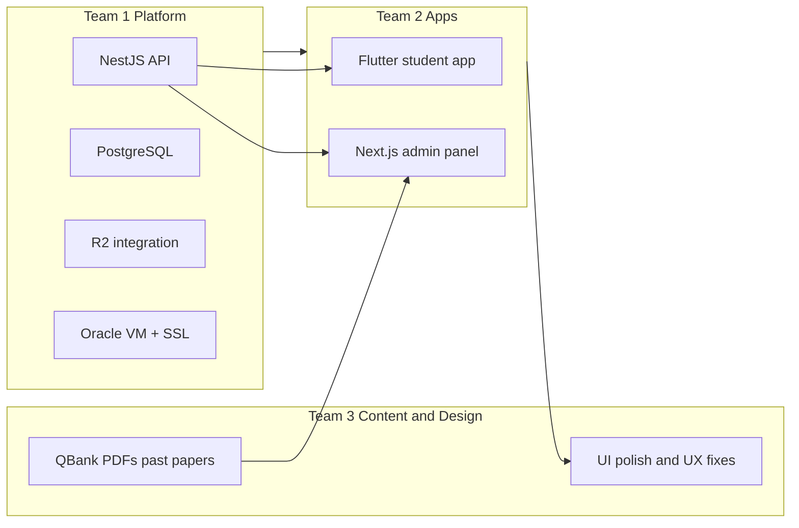

# MedStudy — 3-Team Work Split

**Status:** LOCKED  
**Audience:** 3-person team handoff

---

## Overview

| Team | Role | When they work |
|------|------|----------------|
| **Team 1** | Platform & API | **Day 1 → launch** |
| **Team 2** | Mobile app + Admin panel | **Day 1 → launch** (parallel with Team 1) |
| **Team 3** | Content + design polish | **Content: Day 1** · **Design polish: after app skeleton exists** |



---

## Team 1 — Platform & API (Backend / DevOps)

**Owns:** `backend/` · Oracle VM · PostgreSQL · Cloudflare R2 · API contract

### Responsibilities

| Area | Tasks |
|------|-------|
| **Infrastructure** | Oracle VM setup, Nginx, SSL, env config, backups |
| **Database** | Prisma schema, migrations, seed data (years, subjects, plans) |
| **Auth** | Register, login, JWT, refresh tokens, single-device sessions |
| **Users** | Profiles, ban, device reset (admin endpoints) |
| **Subscriptions** | Plans, RevenueCat webhooks, access guards |
| **Content API** | Years/subjects/topics/materials CRUD, R2 upload, presigned URLs |
| **Exams API** | Questions CRUD, CSV import, exam builder, start/submit/grade |
| **Security** | Rate limiting, signed URLs, certificate pinning config for mobile |
| **Docs** | Keep `docs/API.md` updated; publish OpenAPI/Swagger |

### Deliverables by milestone

| Week | Deliverable |
|------|-------------|
| 1–2 | Repo running locally; DB migrated; auth endpoints live |
| 3–4 | Device binding + subscription guards |
| 5–6 | Materials upload to R2 + presigned access |
| 7–9 | Full exam engine (start, submit, grade, review) |
| 10 | RevenueCat webhooks |
| 11–12 | Production deploy on Oracle VM |
| 13+ | Bug fixes from integration; support Team 2 & 3 |

### Does NOT own

- Flutter UI
- Admin panel UI (Team 2 builds it; Team 1 provides API)
- QBank writing, PDF polishing (Team 3)
- Final visual design polish (Team 3)

---

## Team 2 — Apps (Mobile + Admin)

**Owns:** `mobile/` · `admin/`

### Responsibilities

| Area | Tasks |
|------|-------|
| **Flutter app** | Auth screens, navigation, theme shell |
| **Study flow** | Browse years/subjects, material list, search, bookmarks |
| **PDF viewer** | Secure viewer, watermark overlay, Android `FLAG_SECURE` |
| **Offline** | Encrypted in-app downloads |
| **Exams** | Exam list, timed UI, submit, results, review with explanations |
| **Payments** | RevenueCat SDK, paywall, subscription status |
| **Security (client)** | Secure storage, device ID, auto-logout on 401, iOS screenshot detect |
| **Admin panel** | Login, dashboard, user management |
| **Admin content** | Upload PDFs, organize year/subject/topic |
| **Admin exams** | Question editor, CSV import UI, exam builder, publish |
| **Admin subs** | View/grant subscriptions |

### Deliverables by milestone

| Week | Deliverable |
|------|-------------|
| 1–2 | Flutter + Admin scaffold; login wired to Team 1 auth API |
| 3–4 | Device session handling; admin user list |
| 5–6 | Material browse + PDF viewer (watermark shell) |
| 7–8 | Offline download flow |
| 9–11 | Full exam UI (timer, palette, results, review) |
| 12 | Paywall + RevenueCat |
| 13+ | Integration fixes; hand app to Team 3 for design polish |

### Depends on Team 1

- API endpoints ready per milestone (use mocks if API delayed max 3 days)
- `.env.example` with API base URL
- Swagger or `docs/API.md` for contract

### Does NOT own

- Backend logic, DB, R2 server config
- Content creation (Team 3 uploads via admin Team 2 built)
- Final design pass (Team 3)

---

## Team 3 — Content + Design Polish

**Owns:** All study content · QBank quality · Post-build UX/design · App store assets (copy support)

### Part A — Content (starts **Week 1**, runs parallel)

**This is the biggest ongoing job.** Target: polished, import-ready content before each release gate.

#### QBank (MCQs)

| Task | Standard |
|------|----------|
| Collect raw questions | From notes, books, past papers, existing sheets |
| Normalize format | One row per question → `docs/templates/qbank-template.csv` |
| Required fields | stem, 4–5 options, correct answer, **explanation**, difficulty, tags |
| Image questions | Export diagrams as WebP; name `subject/q{id}-main.webp` |
| Review pipeline | Draft → expert review → QC → ready for import |
| Tags | Always include: `year-X` or `fcps-part-1`, subject, topic |

#### PDFs (notes, books, chapters)

| Task | Standard |
|------|----------|
| Source files | PDF preferred; Word → export PDF |
| Compress | Target 2–15 MB per file; 150 DPI for scans |
| Name consistently | `year-3/pathology/notes-ch03.pdf` |
| Past papers | Tag year + session (e.g. Annual 2024) |
| Copyright check | Only material you have rights to distribute |

#### Images

| Task | Standard |
|------|----------|
| Format | WebP (photos) or PNG (diagrams) |
| Size | Max width 1600px, 100–400 KB each |
| Link to questions | Match `image_key` in CSV to R2 path |

#### Content map (master spreadsheet)

Maintain `content-map.csv` with every file:

```csv
file_path,title,year_slug,subject_slug,topic,tags,type,status
materials/year-3/pathology/past-paper-2024.pdf,Pathology Annual 2024,year-3,pathology,past-papers,past-paper;2024,pdf,READY
qbanks/year-3-pathology.csv,Pathology MCQ Bank,year-3,pathology,general,year-3;pathology,questions,READY
```

#### Content targets (MVP vs full)

| Phase | Target |
|-------|--------|
| **MVP gate** | Year 1–2: all subjects, 500+ MCQs/subject, core PDFs + 2 years past papers |
| **v1 gate** | Year 3–5 + FCPS Part 1: same standard |
| **v1.1** | FCPS Part 2 + image-heavy MCQ sets |

#### Upload workflow (after Team 2 admin is ready)

1. Team 3 marks content `READY` in content-map
2. Upload PDFs/images to R2 via admin (or batch script Team 1 provides)
3. Import QBank CSV via admin
4. Spot-check in Flutter app (read + 1 exam)
5. Fix errors → set `PUBLISHED`

---

### Part B — Design polish (starts **after Week 8–10**, when app skeleton exists)

**Not building from scratch — refining what Team 2 built.**

| Area | Tasks |
|------|-------|
| **UI/UX audit** | Walk every screen; list friction, inconsistency, clutter |
| **Visual design** | Colors, typography, spacing, icons (provide Figma updates) |
| **Mobile polish** | Onboarding, empty states, loading skeletons, error messages |
| **Exam UX** | Timer visibility, question palette, results celebration, review layout |
| **PDF viewer** | Watermark placement, readability, dark mode |
| **Admin polish** | Forms, tables, upload progress, bulk import feedback |
| **Accessibility** | Font sizes, contrast, tap targets |
| **App store assets** | Screenshots, feature graphics, short description copy |
| **Beta feedback** | Triage student feedback; prioritize UX fixes for Team 2 |

### Design polish deliverables

| Deliverable | Format |
|-------------|--------|
| Figma v2 (polished) | Figma file |
| Change list | Markdown checklist with screen names |
| Asset pack | Icons, splash, store screenshots |
| UX test notes | 10–20 student beta sessions summarized |

### Depends on Team 2

- Working app builds (TestFlight / APK) for review
- List of all routes/screens

### Depends on Team 1

- Staging API for realistic testing with real content

---

## How the 3 teams sync

### Weekly sync (30 min)

| Agenda | Who leads |
|--------|-----------|
| API blockers | Team 1 |
| App blockers | Team 2 |
| Content ready this week | Team 3 |
| Next integration milestone | All |

### Integration milestones (must pass together)

| Gate | Team 1 | Team 2 | Team 3 |
|------|--------|--------|--------|
| **Gate 1 — Auth** | Login API live | Apps login + device kick | — |
| **Gate 2 — Content** | Materials API + R2 | PDF viewer works | 1 subject fully READY uploaded |
| **Gate 3 — Exams** | Grading API live | Exam UI end-to-end | 100+ MCQs imported for 1 subject |
| **Gate 4 — Payments** | Webhooks live | Paywall works | — |
| **Gate 5 — Beta** | Staging stable | APK/TestFlight | MVP content complete |
| **Gate 6 — Polish** | Prod deploy | Apply Team 3 design fixes | Design pass + store assets |
| **Gate 7 — Launch** | Monitoring | Store submission | All MVP content PUBLISHED |

---

## Timeline (high level)

```text
Week 1–6
  Team 1: API + auth + content endpoints
  Team 2: App shells + auth + browse UI
  Team 3: Content prep (CSV, PDF compress, content-map) — NO CODE

Week 7–10
  Team 1: Exam engine + subscriptions
  Team 2: PDF viewer + exam UI
  Team 3: MVP content batch 1 ready; start importing via admin

Week 11–13
  Team 1: Production + hardening
  Team 2: Payments + bug fixes
  Team 3: Import all MVP content; beta testing with students

Week 14–16
  Team 1: Launch support
  Team 2: Implement Team 3 design polish
  Team 3: Design audit + Figma v2 + store assets + content batch 2

Week 17+
  Launch → FCPS content → ongoing QBank expansion
```

---

## Folder ownership

| Folder / area | Owner |
|---------------|-------|
| `backend/` | Team 1 |
| `admin/` | Team 2 (UI) · Team 1 (API contract) |
| `mobile/` | Team 2 |
| `docs/API.md`, `DATABASE.md` | Team 1 |
| `docs/templates/` (content) | Team 3 |
| `docs/ROADMAP.md`, `STACK.md` | Shared (changes need all leads) |
| `content/` (raw qbanks, PDFs before upload) | Team 3 |
| Figma | Team 3 (polish) · Team 2 (initial wireframes if no designer) |

Suggested repo layout for Team 3:

```text
content/
├── qbanks/
│   ├── year-1/
│   ├── year-2/
│   └── fcps-part-1/
├── materials/
│   ├── year-1/
│   └── ...
├── images/
│   └── questions/
├── content-map.csv
└── README.md
```

---

## Skills profile per team

| Team | Ideal skills |
|------|----------------|
| **Team 1** | Node.js, NestJS, PostgreSQL, Prisma, Linux, Nginx, AWS S3/R2 |
| **Team 2** | Flutter, Dart, React/Next.js, TypeScript, mobile security basics |
| **Team 3** | Medical domain knowledge, content QC, Figma, UX writing, Excel/CSV; light admin panel use for upload |

Team 3 does **not** need to code — but must follow templates and use the admin panel Team 2 builds.

---

## Quick reference — who does what

| Task | Team |
|------|------|
| NestJS API | 1 |
| PostgreSQL / Prisma | 1 |
| Oracle VM + SSL | 1 |
| R2 server integration | 1 |
| Flutter student app | 2 |
| Next.js admin panel | 2 |
| RevenueCat in app | 2 |
| Write & polish MCQs | 3 |
| Compress & organize PDFs | 3 |
| Past papers tagging | 3 |
| QBank CSV import (data) | 3 |
| Upload content via admin | 3 |
| UI/UX polish after build | 3 |
| App store screenshots & copy | 3 |
| Beta student feedback triage | 3 |

---

## Related docs

**Per-person handoff (give each teammate their own doc):**
- [PERSON_1_PLATFORM.md](./PERSON_1_PLATFORM.md) — Person 1
- [PERSON_2_APPS.md](./PERSON_2_APPS.md) — Person 2
- [PERSON_3_CONTENT_DESIGN.md](./PERSON_3_CONTENT_DESIGN.md) — Person 3

**Reference:**
- [ROADMAP.md](./ROADMAP.md) — full phases
- [DATABASE.md](./DATABASE.md) — schema
- [API.md](./API.md) — endpoints
- [CONTENT_GUIDE.md](./CONTENT_GUIDE.md) — content standards

---

**This split is LOCKED.** Adjust only if team skills differ (e.g. Team 2 only mobile, hire separate admin dev).
